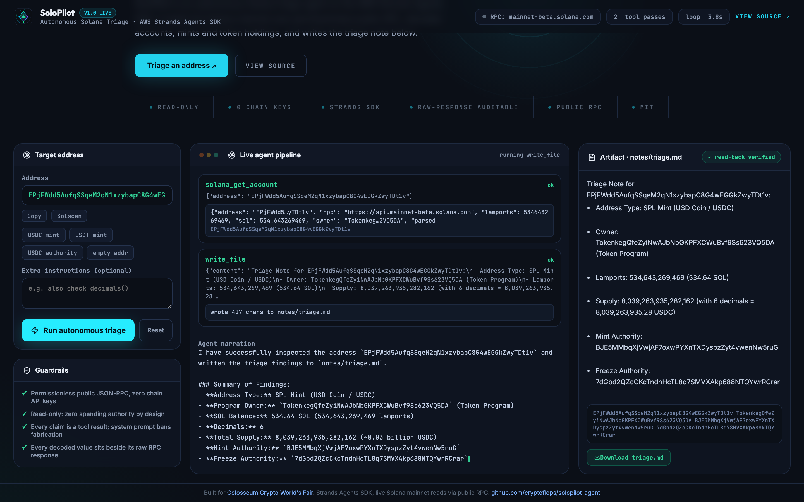

# SoloPilot - autonomous Solana wallet triage agent

Paste any base58 address (wallet or mint) and SoloPilot's agent plans its own
on-chain recon: is it alive, what does it hold, who controls the mint, is it
freeze-risky - then writes a readable triage note. The LLM plans the calls;
the runtime executes them against **keyless public Solana JSON-RPC** (zero
API keys beyond the model). Built on the [AWS Strands Agents SDK](https://strandsagents.com)
with Gemini as the model provider.



## Why this exists

Checking a Solana address before interacting with it means jacking explorer
tabs and squinting at account data: owner program, mint authority, freeze
authority, token holdings. SoloPilot collapses that into one prompt. The
agent decides which RPC calls the question actually needs - getAccountInfo,
getBalance, getTokenAccountsByOwner, chain health - decodes the mint layout
itself, and leaves a `notes/<name>.md` you can forward.

## Quickstart

```bash
python -m venv .venv && source .venv/bin/activate
pip install fastapi uvicorn strands-agents google-genai python-dotenv requests httpx
cp .env.example .env   # add a free key from https://aistudio.google.com/apikey
cd src && uvicorn app:app --port 8000
```

Open http://localhost:8000 - type a task, watch the live tool trace, get the note.

Headless: `python src/run.py "Check mint EPjFWdd5AufqSSqeM2qN1xzybapC8G4wEGGkZwyTDt1v and write notes/usdc.md"`

Self-check (real RPC, no model call): `python src/agent.py` → decodes USDC, asserts decimals == 6.

## Architecture

```
task ──> Strands Agent (Gemini plans tool calls)
            │  solana_get_account   ── getAccountInfo jsonParsed → mint supply/decimals/authorities
            │  solana_balance       ── getBalance
            │  solana_token_balances── getTokenAccountsByOwner
            │  solana_recent_perf   ── blockhash + tx count (chain health)
            │  read_file/write_file ── triage note artifact
            ▼
        mainnet-beta RPC ──fallback──> publicnode RPC
```

- `src/agent.py` - tool set + reasoning loop (trace read from `agent.messages`)
- `src/app.py` - FastAPI `/run` and SSE `/run/stream` endpoints
- `src/stream.py` - token-level streaming of the same loop
- `src/index.html` - single-page console: prompt in, live tool trace out

## Example note

```
Address: EPjFWdd5AufqSSqeM2qN1xzybapC8G4wEGGkZwyTDt1v (USDC)
Supply: 7.69B (6 decimals) · mint authority: BJE5MM… (Centre) · freeze: present
```

## Built for

Road to Colosseum: Build Your MVP (Superteam) / Colosseum Hackathon 2026.
Agent + frontend derived from an earlier EVM recon prototype; everything in
`src/agent.py` - the Solana tool set, jsonParsed mint decoding, holdings and
perf tools - was newly built for Solana during this event window. MIT licensed.
